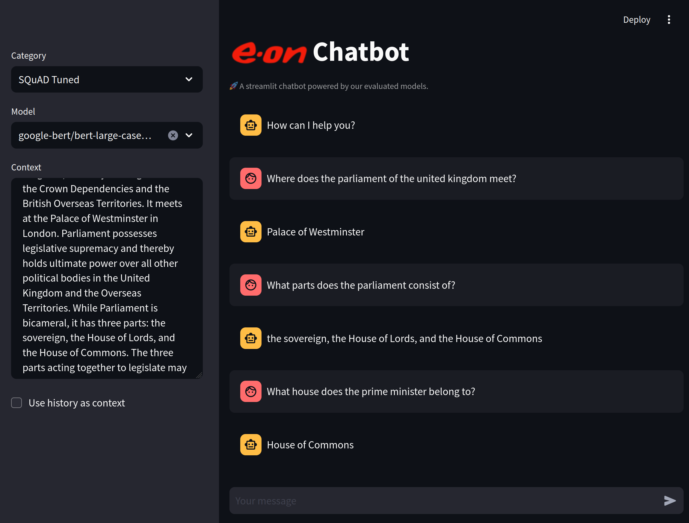

# Chatbot UI

This module provides a graphical user interface for interacting with
the modules that we evaluated.

## Setup

Install the required dependencies by executing the following command in this
directory:

```console
pip install -r requirements.txt
```

## Usage

Start the application by executing the following command in this directory:

```console
streamlit run Chatbot.py
```

This will print a URL on the console which you can open in a browser.

The UI consists of a chat on the right and a sidebar on the left side.
In the sidebar, select first a model category out of the following:

- Base: Untuned models from HuggingFace
- SQuAD Tuned: Models that were fine-tuned for SQuAD on HuggingFace
- GermanQuAD Tuned: Models that were fine-tuned for GermanQuAD on HuggingFace
- Local: User-provided models on the local machine

Afterwards, select a concrete model ID out of the second dropdown menu.

You may now enter a context in the text field in the sidebar and press Ctrl+Enter.
This context will be used as the knowledge base and all queries will be evaluated
with this context in mind.
Alternatively, the chat history can be used as context, but since the models are
not built with chatting in mind, this can lead to weird answers.

At last, start writing queries into the chat input field and wait for predictions
(which can, depending on the model and the hardware, take a while).




